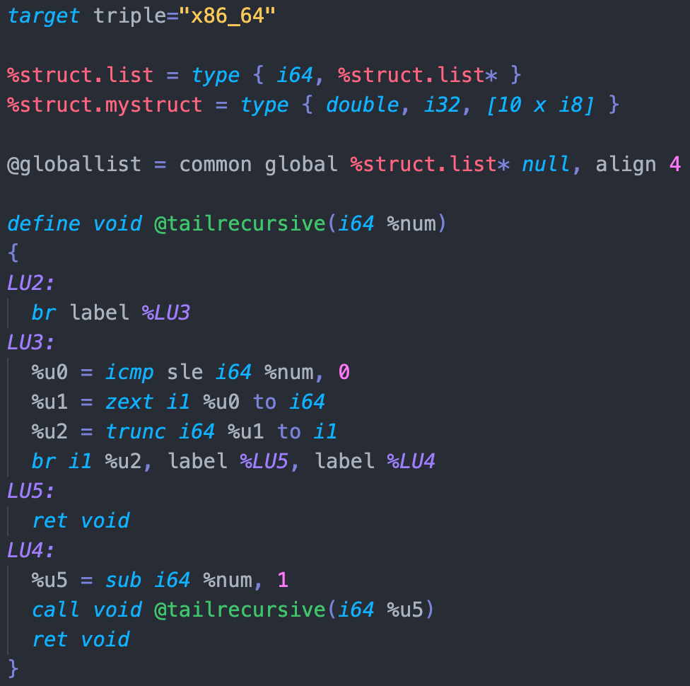

# llvm-syntax-highlighting

This extension provides simple, lightweight syntax highlighting for LLVM IR.

 

 

#
## Language Forms Supported

As LLVM as a language is dense and constantly changing, this extension is meant to provide syntax highlighting to the most common language forms found in LLVM IR

* Types
  * primitive types
  * arrays
  * vectors
  * tokens
  * structs
* Labels
  * branch ir
  * phi ir
* Decorators
  * metadata
  * attributes
* Functions
  * function headers
* Instructions

To request language forms be added, simply add an issue or pull request to the [Github Repo](https://github.com/colejcummins/llvm-syntax-highlighting)

